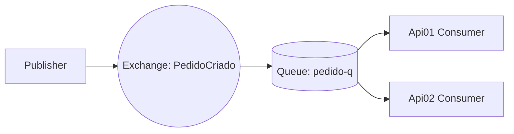
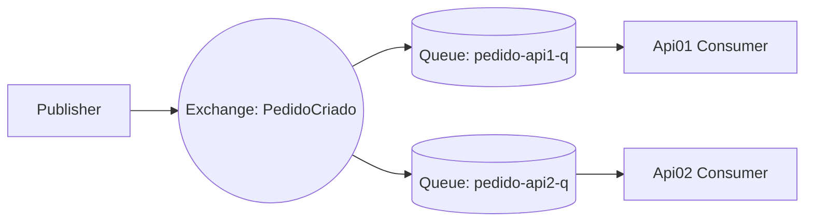

# MassTransit + RabbitMQ PoC

This proof of concept (PoC) demonstrates how **MassTransit** works with **RabbitMQ** when you have multiple consumers across different services or APIs.  

It covers two main scenarios:
1. **Work Queue (Load Balancing)** – messages are distributed across consumers.  
2. **Pub/Sub (Broadcast)** – all consumers receive a copy of the message.  

---

## 📦 Technologies Used
- [.NET 9](https://dotnet.microsoft.com/)  
- [MassTransit](https://masstransit-project.com/) (RabbitMQ transport)  
- [RabbitMQ](https://www.rabbitmq.com/)  

---

## 🔹 Scenario 1 — Work Queue (Load Balancing)

- **Setup**: Two services (Api01 and Api02) consume messages from the **same queue**.
- **Behavior**:  
  - A message published to the `PedidoCriado` exchange is routed to the queue `pedido-q`.  
  - RabbitMQ delivers each message to **only one** consumer (round-robin).  
  - Useful for **horizontal scaling** when multiple services share the workload.

## 🔹Scenario 2 — Pub/Sub (Broadcast)

Setup: Two services (Api01 and Api02) consume messages from different queues, but both queues are bound to the same exchange.
- **Behavior**:  
- A message published to the PedidoCriado exchange is copied to all queues bound to it.
- Both pedido-api1-q and pedido-api2-q receive the same message.
- Useful for event-driven architectures where multiple services must react to the same event.

